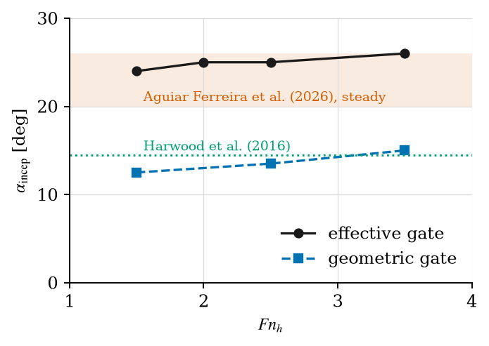
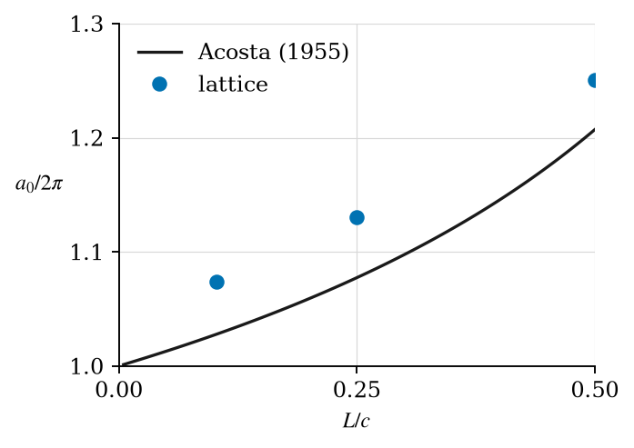
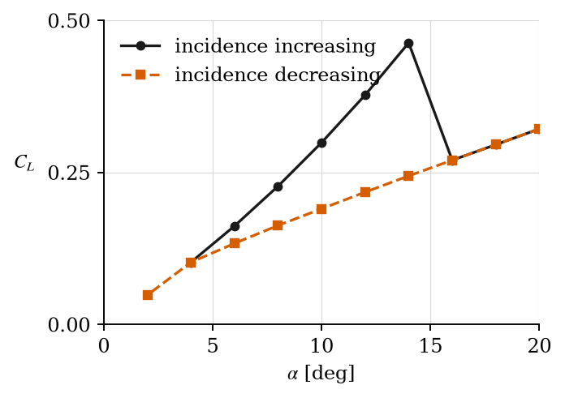

# A vortex lattice method with ventilation: methods, usage and validation plan

*Repository `Fluid-Dynamics-Laboratory/vlm-ventilation`, branch `vent/integration`. September 2026.*

This document describes how the code works, how to run it, which measurements validate it and
how well it does against them. It is written for an engineering undergraduate who has followed a
first course in aerodynamics and knows what a vortex, a boundary layer and a lift coefficient
are. Section 1 explains the problem and the plan of the code. Sections 2 to 8 are the methods,
in the order in which the code executes them. Section 9 shows one complete run. Section 10 is
the validation: the plan, the curves digitised so far and the comparison with the code, which
is detailed in `docs/validation/README.md`. Section 11 lists what the code does not do.

Every quantity is nondimensional unless a unit is stated. Symbols with a hat, such as $\hat c$,
are dimensional; the code itself works in metres, seconds and radians.

## Contents

1. The problem and the plan of the code
2. Nomenclature
3. Running the code
4. The vortex lattice method
5. Section data
6. Inception model
7. Cavity model
8. Regime machine
9. A complete run
10. Validation plan, digitised data and results
11. Limitations
12. References

## 1 The problem and the plan of the code

A hydrofoil that pierces the free surface, or runs close beneath it, may *ventilate*: air from
the atmosphere is drawn into the low-pressure separated flow on its suction side and forms a
cavity. When the cavity covers the suction side the lift falls by 50 to 70 % (Harwood, Young
and Ceccio, 2016). For a foiling boat this is a sudden loss of the force that holds the hull out
of the water. The code predicts, for a given foil, speed and immersion, (i) the loads when the
flow is fully wetted, (ii) whether ventilation incepts and by which route, (iii) the loads once
a cavity is present, and (iv) whether the cavity persists or washes out when the conditions
change, which gives the hysteresis observed in experiments.

The code is a **vortex lattice method** (VLM), a potential-flow method in which the lifting
surface is replaced by a lattice of vortex rings, with a free wake that is shed and convected in
time. It was developed during an internship (Orain, 2026) and revised in this work. Three
layers sit on top of it (Fig. 1.1).

- **Section data** (Sect. 5): two-dimensional viscous properties of the foil section, from a
  surrogate of XFOIL, read as a table. The lattice has no boundary layer, so separation and
  the true suction peak come from here.
- **Inception model** (Sect. 6): reads a converged wetted solution and decides, section by
  section, whether ventilation can start and by which route.
- **Cavity model and regime machine** (Sects. 7 and 8): once ventilation has started, a
  cavity at atmospheric pressure is added to the lattice, its effect on the loads is solved,
  and a state machine decides whether the cavity persists or washes out.

```
   geometry, speed, immersion
              |
              v
   +---------------------+      +----------------------+
   | VLMSurface          |----->| VLMSolver            |  wetted solution:
   | panels, rings,      |      | influence matrix,    |  circulation, sectional lift,
   | free-surface image  |      | wake, loads          |  effective incidence
   +---------------------+      +----------+-----------+
                                           |
              +----------------------------+----------------------------+
              v                                                         v
   +---------------------+                                   +----------------------+
   | VLMInception        |<-- section_data (NeuralFoil) -->  | VLMCavity            |
   | condition A per     |                                   | CavitySolver:        |
   | section, routes     |-------- inception signal -------->| cavity on the lattice|
   +---------------------+                                   | + regime machine     |
                                                             +----------------------+
                                                                        |
                                                                        v
                                                         loads, cavity length, regime,
                                                         centre of pressure, hysteresis
```
*Figure 1.1. Data flow of the code. Each box is one Python module in `src/`.*

The layers are independent. The inception model reads a solution and writes a dictionary; the
cavity model accepts any function that produces such a dictionary. This is why the two were
developed on separate branches (`vent/inception`, `vent/cavity-regime`) and are merged here.

## 2 Nomenclature

| Symbol | Meaning |
|---|---|
| $\alpha$ | geometric incidence of the surface; for a vertical strut it is the drift angle |
| $\alpha_\text{eff}$ | effective incidence of a section, $C_l/(2\pi\cos\lambda)$ |
| $\alpha_\text{sep}$ | incidence at which the section's suction side separates (stall) |
| $a_0$ | sectional lift slope; $2\pi$ for a thin wetted section |
| $AR$, $AR_h$ | aspect ratio; immersed aspect ratio $h/\bar c$ of a surface-piercing strut |
| $b$, $b_\min$ | span; smallest panel dimension of the lattice |
| $c$, $\bar c$ | local chord; mean chord |
| $C_L$, $C_l$ | lift coefficient of the surface, on $\tfrac12\rho u_\infty^2 S$; sectional lift coefficient |
| $C_p$, $C_{p,\min}$ | pressure coefficient; its minimum on the suction side |
| $d$ | cutoff distance of the Biot–Savart law |
| $e$ | centre of pressure forward of mid-chord, in chords |
| $Fn_h$, $Fn_c$ | depth Froude number $u_\infty/\sqrt{g h}$; chord Froude number $u_\infty/\sqrt{g c}$ |
| $g$ | gravitational acceleration |
| $h$ | immersion of a strut (depth of its tip) |
| $L$ | cavity length in chords |
| $M$, $N$ | number of chordwise and spanwise panels |
| $q$ | source strength of a cavity panel (transpiration velocity) |
| $r_c$ | vortex core radius |
| $Re_c$ | chord Reynolds number $u_\infty c/\nu$ |
| $u_\infty$ | free-stream speed |
| $\Gamma$, $\gamma$ | circulation of a ring; bound vorticity per unit chord |
| $\lambda$ | mid-chord sweep angle |
| $\sigma_c$ | cavitation number of an atmospheric cavity at depth $z$, $2 g |z| / u_\infty^2$ |
| $\phi$ | angle of the cavity closure line from the flow direction |
| $\Psi$ | cavity parameter $\sigma_c/(2\alpha_\text{eff})$ |
| FW, PV, FV | fully wetted, partially ventilated, fully ventilated regimes |

Coordinates: $x$ streamwise, $z$ vertical with the undisturbed free surface at $z = 0$. A
horizontal wing lies in the $x$–$y$ plane (`plan=1`); a vertical strut lies in the $x$–$z$ plane
(`plan=0`) and occupies $0 \le z \le h$ below the surface.

## 3 Running the code

### 3.1 Installation

Python 3.10 or later. From the repository root:

```
pip install -r requirements.txt
```

This installs NumPy, Numba (which compiles the Biot–Savart kernel), Matplotlib, Jupyter and
NeuralFoil. Nothing needs a compiler.

### 3.2 First run

The notebook `vlm_unsteady_wake.ipynb` runs the wetted solver on a rectangular wing of aspect
ratio one at 10° and plots the wake and the sectional lift. From the repository root:

```
jupyter lab vlm_unsteady_wake.ipynb
```

The lift coefficient printed at the end should be 0.386. The same case as a script, in about
five seconds:

```python
import sys; sys.path.append("src")
import numpy as np
from VLMSurface import VLMSurface
from VLMSolver import VLMSolver

N, M = 15, 5                                   # spanwise panels per half-span, chordwise panels
wing = VLMSurface(origin=np.zeros(3), plan=1, boundary=False, shedding="both", b=1.0,
                  c=np.ones(N + 1), alpha=np.deg2rad(10), beta=0, lamb=0, delta=0, phi=0,
                  sym=True, space=True, n=N, m=M)
wing._build_wing()
vlm = VLMSolver([wing], u_inf=np.array([1.0, 0, 0]), boundary=False, ratio=0.05, a_ratio=0.4)
vlm._time_sim(t=3.0, dt=0.1, distribution="classic")    # three chords of travel
vlm._kuttas_loads()
print("CL =", -2*wing.loads[2])                          # 0.386
```

The arguments of `VLMSurface` are, in order: origin of the surface; plane (0 vertical, 1
horizontal); whether a free-surface image is built; which tips shed vorticity (`"both"`,
`"left"`, `"right"`, `"none"`); span; chord at each of the $N+1$ spanwise stations; incidence,
drift, sweep, dihedral and twist in radians; whether the wing is mirrored about its root; cosine
spacing towards the tips; and the panel counts. The two numbers passed to `VLMSolver` are the
vortex core radius in chords and the cutoff of the boundary condition in units of the smallest
panel dimension (Sect. 4.6).

### 3.3 Tests, verification and validation scripts

| Command | What it does | Time |
|---|---|---|
| `python tests/test_inception.py` | unit checks of the section data and the inception routes | 1 min |
| `python tests/test_cavity.py` | unit checks of the source kernel, the cavity and the regime machine | 3 min |
| `python docs/tip_loading/study.py` | mesh and time-step convergence of the wetted solver, original against revised | 3 min |
| `python docs/cavity/verify_acosta.py` | lattice cavity against Acosta's linear theory | 5 min |
| `python docs/inception/validate.py` | inception against published values | 25 min |
| `python docs/cavity/validate.py` | ventilated loads, closure angle and hysteresis on the strut of Harwood et al. | 20 min |
| `python docs/report/example_end_to_end.py` | the complete run of Sect. 9 | 5 min |
| `python docs/validation/import_digitised.py` | converts the raw digitised curves of `docs/validation/data/raw/` into the template format | 1 s |
| `python docs/validation/validate.py` | compares the code with every digitised curve in `docs/validation/data/` (Sect. 10.5) | 25 min |

Each script prints its results and writes a JSON file next to itself. The first run of any
script takes an extra minute while Numba compiles the kernel.

### 3.4 Repository layout

```
src/VLMPanel.py, VLMSurface.py, VLMSolver.py    the vortex lattice method (Sect. 4)
src/section_data.py, section_data/*.json        section data (Sect. 5)
src/VLMInception.py                             inception model (Sect. 6)
src/VLMCavity.py, vent_section.py               cavity model and regime machine (Sects. 7, 8)
tests/                                          unit checks
docs/tip_loading/                               convergence study and its report (Sect. 4.7)
docs/inception/, docs/cavity/                   per-model documentation and validation scripts
docs/report/                                    this document, its figures, the complete run
docs/validation/                                digitised data, the importer and the comparison script (Sect. 10)
vlm_unsteady_wake.ipynb                         the working notebook
```

## 4 The vortex lattice method

### 4.1 Idea

In potential flow a thin lifting surface can be replaced by a sheet of vorticity. The vortex
lattice method discretises the sheet into $N \times M$ quadrilateral panels, each carrying a
closed vortex ring of unknown circulation $\Gamma_k$ (Katz and Plotkin, 2001, Sect. 12.3).
Every ring induces a velocity everywhere in the fluid by the Biot–Savart law. The rings'
circulations are found from one condition per panel: the flow must not cross the surface at
the panel's control point. Once the circulations are known, the loads follow from the
Kutta–Joukowski theorem.

### 4.2 Geometry and panels (`VLMSurface`, `VLMPanel`)

The planform is built from the chord at each spanwise station, the sweep, dihedral and twist.
Spanwise stations are spaced uniformly or clustered towards the tips with a cosine law, which
resolves the tip loading. Each panel has four corners; its vortex ring is the panel shifted
downstream by a quarter of the panel chord, so that the ring's leading segment, the *bound
vortex*, lies at the panel's quarter chord and the control point at its three-quarter chord.
This placement makes a single panel satisfy the two-dimensional Kutta condition exactly
(Pistolesi's theorem).

A symmetric wing is built from one half and mirrored. A surface-piercing strut is built with
`plan=0`, its span along $z$, and `sym=False`, so that it occupies $0 \le z \le h$ with the
free surface at $z = 0$.

### 4.3 Influence coefficients and the boundary condition (`VLMSolver._build_A`, `_build_b`)

The velocity induced at a point by a straight vortex segment of circulation $\Gamma$ from
$\boldsymbol r_1$ to $\boldsymbol r_2$ is

$$\boldsymbol v = \frac{\Gamma}{4\pi}\,\frac{\boldsymbol r_1 \times \boldsymbol r_2}{|\boldsymbol r_1 \times \boldsymbol r_2|^2}\,
   \boldsymbol r_0 \cdot \left(\frac{\boldsymbol r_1}{|\boldsymbol r_1|} - \frac{\boldsymbol r_2}{|\boldsymbol r_2|}\right),
   \qquad \boldsymbol r_0 = \boldsymbol r_2 - \boldsymbol r_1. \tag{4.1}$$

The kernel `_induced_velocity` evaluates (4.1) for every segment at every point, compiled by
Numba and parallelised. Two regularisations are available and are used for different purposes
(Sect. 4.6): a hard *cutoff* $d$, below which a segment induces nothing, and a smooth *vortex
core* of radius $r_c$, which multiplies (4.1) by $h^2/(h^2 + r_c^2)$ with $h$ the distance to
the segment (Scully profile).

The boundary condition at control point $k$ with normal $\boldsymbol n_k$ is

$$\sum_{l} a_{kl}\,\Gamma_l = -\left(\boldsymbol u_\infty + \boldsymbol v_\text{wake}\right)\cdot\boldsymbol n_k, \tag{4.2}$$

where $a_{kl}$ is the normal velocity induced at $k$ by ring $l$ with unit circulation. The
matrix $\boldsymbol A = [a_{kl}]$ depends only on the geometry and is inverted once. The
right-hand side contains the free stream and the velocity induced by the wake rings whose
strengths are already known.

### 4.4 Wake and time stepping (`VLMSolver._time_sim`)

The wing is started impulsively and marched in time with a step $\Delta t$. At each step:

1. the existing wake is convected downstream by $u_\infty \Delta t$;
2. one new row of rings is shed from the trailing edge, and one new column from each tip if tip
   shedding is enabled;
3. the circulations are solved from (4.2). The rings shed at *this* step carry the *current*
   circulation of the panels they are shed from, and their influence is placed in $\boldsymbol A$
   rather than in the right-hand side. This is the implicit Kutta condition of Katz and Plotkin
   (Sect. 13.12). It matters: with an explicit treatment the tip vorticity and the shed vorticity
   cancel only with a one-step lag, and the tip circulation then relaxes at a rate proportional
   to the tip panel width, so that a fine mesh never reaches steady state within a reasonable
   travel (Sect. 4.7);
4. the wake corner points are convected by the velocity induced by the whole system, with the
   vortex core of radius $r_c$: this is the roll-up of the wake into tip vortices.

*Tip shedding.* Ordinary vortex lattice methods shed vorticity from the trailing edge only.
For a low-aspect-ratio wing, or a strut with a free tip, the flow also separates along the side
edge. The code sheds a column of rings from each tip whose strength equals the circulation of the
adjacent panels, exactly as at the trailing edge. The wing's tip-edge vorticity is then
cancelled by the shed edge, and the tip vortex leaves along the whole side edge instead of at
the trailing corner. This raises the lift of a wing of aspect ratio one at 10° from 0.26 to 0.39
and makes the sectional lift finite at the tip; both are the expected effect of side-edge
separation, and the value agrees with the vortex lattice method of Rodriguez (1990) that has
the same feature.

### 4.5 Free surface

The free surface is represented by an image of the whole lattice and wake in the plane $z = 0$.
Two images are available. The *antisymmetric* image, in which the image rings have the same
circulation as the real ones, makes the pressure on the plane atmospheric; this is the exact
condition in the limit of high Froude number, where gravity is too weak to deform the surface
on the time scale of the flow. The *symmetric* image, with opposite circulation, makes the
plane a rigid wall, the low-Froude limit. The internship report validated the antisymmetric
image against measured lift for $Fn_c \ge 1.5$ and found neither image adequate at
$Fn_c \approx 1$. The code warns when a case is run below $Fn_c = 1.5$. A Froude-dependent free
surface was considered and deferred, because the intended applications lie above that limit and
a free-surface panel method would multiply the cost by two to four.

For the inception and cavity models the free surface enters a second time, through the
hydrostatic pressure: a cavity open to the atmosphere at depth $z$ has the cavitation number

$$\sigma_c(z) = \frac{p_\text{atm} + \rho g |z| - p_\text{atm}}{\tfrac12 \rho u_\infty^2} = \frac{2 g |z|}{u_\infty^2} = \frac{2}{Fn_h^2}\,\frac{|z|}{h}. \tag{4.3}$$

It is zero at the waterline and largest at the tip.

### 4.6 Loads and numerical parameters (`VLMSolver._kuttas_loads`)

The load on each bound and trailing segment follows from the linearised Kutta–Joukowski
theorem, $\boldsymbol F = \rho\,\boldsymbol u_\infty \times \boldsymbol\Gamma$ (Katz and Plotkin,
Eq. 12.25). The velocity induced by the lattice itself at a segment midpoint is not used for
the lift: it is of order $\Gamma/b$ for a panel of width $b$ and does not converge under
refinement. It is kept in a separate vector, `surface.loads_induced`, which carries the
induced drag. The sectional lift coefficient of each strip, `surface.Cl_2d`, is the lift of
its bound segments on the strip area.

Two numerical parameters are passed to the solver.

- `a_ratio` (default 0.4): the cutoff $d$ of the boundary condition, in units of the smallest
  panel dimension $b_\min$ (width or chord). The influence matrix and the wake term of the
  right-hand side must use the *same* cutoff, because the wing's tip-edge segment sits in the
  matrix and the coincident shed edge in the right-hand side, and they must cancel. It must stay
  below 0.5, or a control point falls inside the cutoff of its own ring.
- `ratio` (default 0.05): the vortex core radius $r_c$ for the wake roll-up and the induced
  loads, in units of the mean chord. A physical length rather than a mesh length, so the results
  converge as the mesh is refined. The lift varies by about 1 % for $r_c/\bar c$ between 0.02
  and 0.1.

Recommended settings: cosine spacing, $u_\infty\Delta t/c \le 0.05$, at least three chords of
travel for a steady case.

### 4.7 Verification of the wetted solver

The revision of the solver is documented in `docs/tip_loading/report.html`, with the study
that produced Table 4.1. The test is the wing of aspect ratio one at 10° with both tips
shedding.

*Table 4.1. Tip sectional lift and lift coefficient of the revised solver.*

| Variation | Tip $C_l$ | $C_L$ |
|---|---|---|
| Core radius $r_c/c$ = 0.02, 0.05, 0.10 | 0.393, 0.386, 0.369 | 0.387, 0.386, 0.381 |
| $N$ = 16, 30, 50, 80 spanwise panels | 0.382, 0.386, 0.388, 0.390 | 0.386, 0.386, 0.387, 0.388 |
| $u_\infty\Delta t/c$ = 0.1, 0.05, 0.025 | 0.386, 0.374, 0.375 | 0.386, 0.382, 0.383 |
| Reference: Rodriguez (1990) VLM; Bartlett and Vidal (1955) experiment | | 0.37; 0.33 |

Before the revision the tip value ranged from $-0.21$ to 0.49 over the same variations. The
lift coefficient is 4 % above Rodriguez and 17 % above the measurement, the latter difference
being attributed in the report to flow separation the potential-flow model cannot capture.

## 5 Section data

### 5.1 Why they are needed

The lattice is inviscid. It cannot tell whether the boundary layer has separated, and its
pressure at the leading edge is singular. Ventilation inception depends on both. The code
therefore reads, for the section in use, three functions of incidence and Reynolds number:

- $\alpha_\text{sep}(Re_c)$, the incidence at which the suction side separates over a large
  part of the chord, taken as the incidence of maximum lift (stall);
- $C_{p,\min}(\alpha, Re_c)$, the minimum pressure coefficient on the suction side with the
  boundary layer present;
- $x_\text{sep}(\alpha, Re_c)$, the chordwise position of turbulent separation.

### 5.2 NeuralFoil

XFOIL (Drela, 1989) is the standard tool for these quantities, but it is a Fortran program that
must be compiled. NeuralFoil (Sharpe, 2025) is a neural network trained on about eight million
XFOIL runs; it is pure Python, installs with pip, and returns in a few milliseconds the force
coefficients, the transition points, the boundary-layer edge velocity $u_e$ and shape factor
$H$ at 32 stations on each surface, and a *confidence* between 0 and 1 that falls where XFOIL
itself would not have converged.

`SectionData.from_neuralfoil(coordinates, name)` builds the table for any section from its
coordinates: $C_{p,\min} = 1 - \max(u_e/u_\infty)^2$ on the suction side, $\alpha_\text{sep}$
from the first lift maximum, $x_\text{sep}$ from the first station downstream of transition
where $H > 2.8$. The table is a JSON file with the grids and the arrays, so that XFOIL polars
can be written in the same format when a compiled XFOIL is available (the conda-forge package
`libxfoil` or the PyPI package `xfoil` on a machine with gfortran). `SectionData.naca0009()`
loads the NACA 0009 table supplied with the code.

*Table 5.1. NACA 0009 from NeuralFoil against published values.*

| $Re_c$ | $\alpha_\text{sep}$, NeuralFoil | published | confidence at stall | $C_{p,\min}$ at 10° |
|---|---|---|---|---|
| $10^5$ | 8.5° | 9° (Sheldahl and Klimas, 1981) | 0.62 | −1.3 |
| $5\times10^5$ | 11.0° | 10 to 11° | 0.84 | −4.7 |
| $10^6$ | 13.0° | 12° | 0.93 | −4.5 |
| $1.6\times10^6$ | 14.5° | 14.5° (Harwood et al., modified section) | 0.95 | −4.5 |
| $3\times10^6$ | 16.5° | 13 to 14° (Abbott and von Doenhoff, 1959) | 0.97 | −4.5 |

The surrogate is within a degree of the published stall up to $Re_c = 1.6\times10^6$, which
covers the towing-tank experiments, and overestimates it above $3\times10^6$ as XFOIL does for
thin sections. Its confidence is above 0.84 for $Re_c \ge 5\times10^5$. The inviscid suction
peak at 10° is $-9.2$, twice the viscous one; an earlier version of the table used it and was
labelled provisional; it is kept as `SectionData.naca0009("provisional")`.

## 6 Inception model (`VLMInception`)

### 6.1 The two necessary conditions

Natural ventilation requires two things at the same time (Harwood et al., 2016; Young et al.,
2017): **(A)** a region of separated flow at sub-atmospheric pressure on the suction side, and
**(B)** a path by which air can travel from the free surface into that region. Condition A is a
property of each section. Condition B depends on how the low-pressure region connects to the
surface, and three routes are recognised: *nose* ventilation, when leading-edge separation
reaches the waterline; *tail* ventilation, when the depression behind a blunt trailing edge
is amplified into a trough that reaches the separated flow; *tip-vortex* ventilation, when the
tip vortex of a submerged element is strong enough and shallow enough to reach the surface.

### 6.2 Condition A on each section

After a wetted run, the model computes for each spanwise section $j$ its depth $z_j$, its
cavitation number from (4.3), its Reynolds number, and its effective incidence from the
sectional lift of the lattice, $\alpha_{\text{eff},j} = C_{l,j}/(2\pi\cos\lambda)$. The section is
**separated** if $\alpha_\text{gate} \ge \alpha_\text{sep}(Re_c)$ and **sub-atmospheric** if
$-C_{p,\min}(\alpha_{\text{eff}}, Re_c) \ge \sigma_c(z_j)$. It is *ventilation-prone* when both
hold.

The incidence $\alpha_\text{gate}$ that decides separation is a choice, because the two
published data sets disagree (Sect. 6.4). With `seal="effective"` it is the section's own
effective incidence, which on a strut of immersed aspect ratio one is about half the geometric
one because the free surface unloads the waterline. With `seal="geometric"` it is the
geometric incidence, as in Viola's `bem-fem-fsi`.

### 6.3 Condition B, the routes

- **Nose**: a prone section lies within the waterline band $|z| \le 0.5\,c$. The band is a
  parameter; the result is insensitive to it between 0.25 and 1.0 chord.
- **Tail**: the trailing edge is blunt (`surface.blunt_te = True`), its base pressure
  $C_{p,\text{base}} = -0.3$ is sub-atmospheric within the band, and $Fn_h > AR_h^{-1/2}$, the
  condition under which the surface depression grows (Aguiar Ferreira et al., 2026).
- **Tip vortex** (`submerged=True`): the vortex strength is the largest sectional circulation
  of the element, the core pressure $C_{p,\text{core}} = -\Gamma^2/(4\pi^2 r_c^2 u_\infty^2)$
  is sub-atmospheric at the shallowest point of the tip filament of the free wake, and that
  point is within one core radius of the surface. No published experiment isolates this route;
  the code labels it unvalidated.

The call `VLMInception.assess(surface, solver, data, g, nu, band, seal, submerged)` returns
the per-section state, the fraction of the span that is prone, the state of each route, the
confidence of the section data, and the flags `incepts` and `route`. `VLMInception.report`
prints it as a table.

### 6.4 Validation against published values

Figure 6.1 and Table 6.1 give the predicted inception incidence of the strut of Harwood et al.
(NACA 0009-type section, chord 0.279 m, $AR_h = 1$) against Froude number for the two gates.
Harwood et al. formed cavities at about 14.5°, independent of $Fn_h$, during acceleration and
with perturbations; Aguiar Ferreira et al. measured spontaneous inception under steady
conditions at 20° to above 25°, rising with Froude number. The geometric gate reproduces the
first within 1 to 2°, the effective gate the second. The tail threshold is implemented as
published and its case only checks the implementation.


*Figure 6.1. Predicted inception incidence versus depth Froude number for the two separation
gates, strut of Harwood et al., $AR_h = 1$, with the two published ranges.*

*Table 6.1. Predicted inception incidence.*

| $Fn_h$ | $Re_c$ | effective gate | geometric gate |
|---|---|---|---|
| 1.5 | $6.9\times10^5$ | 24° | 12.5° |
| 2.5 | $1.2\times10^6$ | 25° | 13.5° |
| 3.5 | $1.6\times10^6$ | 26° | 15.0° |

## 7 Cavity model (`VLMCavity.CavitySolver`)

### 7.1 A cavity on the lattice

A ventilated cavity is a region of the suction side where the pressure is atmospheric, so
$C_p = -\sigma_c(z)$ there, and where the flow leaves the surface and follows the cavity
boundary. In linearised thin-section theory (Acosta, 1955; Tulin, 1953) it is represented on
the mean surface by a distribution of sources $q$, which gives the cavity a thickness, on top
of the vorticity that represents the lift. The code follows this on the lattice. A ventilated
panel carries, besides its ring, a constant-strength source sheet, and two conditions hold on
it instead of one:

$$(\boldsymbol u_\infty + \boldsymbol v_\text{rings} + \boldsymbol v_\text{sources})\cdot\boldsymbol n_\text{p} = 0
   \quad\text{on the wetted side (kinematic),} \tag{7.1}$$

$$\boldsymbol u_\infty\cdot\boldsymbol\tau + \boldsymbol v_\text{wake}\cdot\boldsymbol\tau
   + \boldsymbol v_\text{sources}\cdot\boldsymbol\tau + \tfrac12\gamma_i = u_\infty\left(1 + \tfrac12\sigma_c\right)
   \quad\text{on the cavity side (dynamic).} \tag{7.2}$$

Here $\gamma_i = (\Gamma_i - \Gamma_{i-1})/\Delta c_i$ is the bound vorticity per unit chord of
the panel, and $\pm\gamma_i/2$ is the jump of tangential velocity across the sheet, which is the
only tangential velocity a planar lattice induces on itself. The source sheet emits $q/2$ on
each side; the normal velocity of (7.1) is evaluated at a point displaced to the wetted side, so
the own-panel term is included. Equation (7.2) is linearised as in Acosta, so that the
verification of Sect. 7.4 compares like with like. The unknowns are all ring strengths plus the
source strengths of the cavity panels; the system is square and solved directly at each step.

The velocity of a constant-strength source quadrilateral is that of Hess and Smith (1962). The
in-plane part uses the edge logarithms of Katz and Plotkin (Sect. 10.4.1); the normal part is
the solid angle of the panel at the point, $w = \Omega/4\pi$, which the code computes from two
triangles and which has no special case for edges parallel to an axis. Its checks are in
`tests/test_cavity.py`: $w = \pm\tfrac12$ on the two sides, the far field of a point source, and
the two-dimensional sheet limit.

### 7.2 Cavity length

The chordwise length $L_j$ of the cavity on section $j$ is taken from the sectional theory. With
$\Psi_j = \sigma_c(z_j)/(2\alpha_{\text{eff},j})$, where $\alpha_\text{eff}$ is that of the wetted
solution of the same step, $L_j = L(\Psi_j)$ from the blend of Acosta's partial-cavity and
Tulin's supercavity solutions used by Harwood et al. (module `vent_section`, reused verbatim
from Viola's `bem-fem-fsi`, MIT licence). The cavity covers the whole panels up to $L_j$ and the
load is interpolated between the two bracketing panel counts, so it is continuous in the
incidence.

An iteration of the length on the lattice, adjusting it until the cavity thickness vanishes at
its end, was implemented and abandoned: the source strengths of a collocated source–vortex
lattice alternate in sign from panel to panel, and the thickness at closure is noise. The
closure residual is kept as a diagnostic.

### 7.3 Two branches

The linear closed-cavity theory holds for $L \le 0.5$. Up to that length the section is solved
on the lattice as above, and the lift follows from the redistributed circulation. Beyond it,
the sectional lift slope $a_0(L)$ of the blend is imposed on the section by scaling the
free-stream term of its kinematic condition by $a_0/2\pi$, which is the effective-incidence
correction of the internship report in a conservative form. The two branches agree to 4 % at
$L = 0.5$. The length used for the loads is capped at ten chords, where $a_0$ is within 1 % of
its supercavitating limit $\pi/2$.

The centre of pressure $e$ of each section is computed from the chordwise distribution of bound
vorticity on the lattice branch, and from the sectional blend, which tends to $3c/16$ for a
supercavity, on the sectional branch.

### 7.4 Verification against Acosta

A rectangular wing of aspect ratio 40 with a uniform prescribed cavitation number approximates
a two-dimensional flat plate. Figure 7.1 compares the lift slope of its mid-span section with
Acosta's closed form $a_0 = \pi(1 + 1/\sqrt{1 - L})$. The lattice is 4 to 5 % high over the
whole range and reproduces the rise of the lift slope above $2\pi$ that a short cavity
produces by its displacement.


*Figure 7.1. Lift slope ratio versus cavity length for a partial cavity from the leading edge,
lattice against Acosta (1955); aspect ratio 40, $\alpha = 4°$, 16 chordwise panels.*

## 8 Regime machine (`VLMCavity.Ventilation`)

### 8.1 States and rules

The flow on each surface is in one of three regimes: fully wetted (FW), partially ventilated
(PV) or fully ventilated (FV). The machine follows Harwood et al. (2016) and the design of
`bem-fem-fsi`.

- **Formation.** A cavity forms when the inception signal fires. The signal is any function
  `(surface, solver) -> assessment` returning the dictionary of `VLMInception.assess`; two
  simple ones are provided, `stall_gate(alpha_deg)` and `vent.force(surface)`, the latter being
  the perturbation route of the experiments. The cavity is seeded on the prone sections that
  can hold one, and grows at a rate limit (default 0.2 chords of cavity per chord of travel), so
  that formation takes a few convective times as observed.
- **Persistence.** A ventilated section keeps its cavity as long as a cavity can exist there
  (sectional length of at least one panel). It never asks again for the seal. This asymmetry is
  the hysteresis: a cavity survives to incidences well below the one at which it formed.
- **Elimination.** Harwood et al. found that a fully ventilated cavity washes out when the
  re-entrant jet at its closure has an upstream component, that is when the closure line makes
  more than 45° with the flow. The code evaluates the local angle of the closure line at the
  representative mid-depth section from the sectional lengths, using the long-cavity relation
  $L = 2.31/\Psi$ that Harwood et al. used to derive their washout boundary. Above the
  formation boundary an unstable cavity persists and sheds (PV); below it the flow rewets after
  the cavity has been unstable for three chords of travel.
- **Label.** FW when nothing is ventilated; FV when the cavity reaches the tip and the closure
  line is stable; PV otherwise.

A sweep in incidence or speed carries the state from one run to the next with `carry_state`.

### 8.2 Validation on the strut of Harwood et al.

Table 8.1 gives the fully ventilated loads at $Fn_h = 2.5$ against the semi-empirical relation of
Damley-Strnad, Harwood and Young (2019), which was fitted to the towing-tank data of several
campaigns, and Figure 8.1 the hysteresis loop.

*Table 8.1. Ventilated to wetted lift ratio, $AR_h = 1$, $Fn_h = 2.5$.*

| $\alpha$ | $C_L$ wetted | $C_L$ ventilated | ratio, this code | ratio, Damley-Strnad et al. | $e$ wetted | $e$ ventilated |
|---|---|---|---|---|---|---|
| 6° | 0.162 | 0.133 | 0.82 | 0.96 | 0.224 | 0.191 |
| 10° | 0.299 | 0.190 | 0.64 | 0.69 | 0.203 | 0.188 |
| 14° | 0.463 | 0.244 | 0.53 | 0.57 | 0.189 | 0.188 |
| 18° | 0.661 | 0.296 | 0.45 | 0.53 | 0.174 | 0.188 |

The code is 5 to 15 % below the semi-empirical relation with the same trend; both lie in the
50 to 70 % loss reported at high incidence. Against the measured lift curves at the same
condition, digitised later, the code is within 1 % on average (Sect. 10.5). At the published washout condition, $\alpha = 20°$
and $Fn_h = 1.5$, the computed closure angle at mid-depth is 34.5° against the measured 40.75°.


*Figure 8.1. Lift coefficient versus incidence swept up from a wetted state and down from a
ventilated one, strut of Harwood et al., $Fn_h = 2.5$, stall gate at 14.5°.*

The ascending branch stays wetted to 14° and ventilates at 16°; the descending branch stays
fully ventilated to 10°, sheds partially at 8° and 6°, and rewets at 4°. The bistable band,
6° to 14°, is the one Harwood et al. report at this Froude number, and `bem-fem-fsi` computes
4° to 14°.

## 9 A complete run

`docs/report/example_end_to_end.py` runs the three layers together on the strut of Harwood et
al. at $Fn_h = 2.5$: the inception model with the geometric gate supplies the signal, the
regime machine forms and eliminates the cavity, the cavity model gives the loads. The essential
lines are:

```python
data = SectionData.naca0009()                                    # section data (Sect. 5)

def inception(surface, solver):                                  # the signal (Sect. 6)
    return vi.assess(surface, solver, data, g=9.81, nu=1e-6, band=0.5, seal="geometric")

strut = VLMSurface(np.zeros(3), 0, True, "both", 2*h, np.ones(N + 1)*c, 0.0, np.deg2rad(alpha),
                   0, 0, 0, False, True, N, M); strut._build_wing()
vlm = CavitySolver([strut], np.array([u, 0, 0]), "antisymmetric", 0.05, 0.4, g=9.81,
                   rate=3.0, inception=inception)                # cavity + regime (Sects. 7, 8)
carry_state(previous_vlm, previous_strut, vlm, strut)            # hysteresis across the sweep
vlm._time_sim(4*c/u, 0.05*c/u, "classic"); vlm._kuttas_loads()
vlm.vent.report(strut)
```

The output for the sweep is in Table 9.1 (`example_end_to_end.json`).

*Table 9.1. End-to-end sweep, strut of Harwood et al., $Fn_h = 2.5$.*

| sweep | $\alpha$ | $C_L$ | regime | route | ventilated fraction | $L$ at mid-depth | $e$ at mid-depth |
|---|---|---|---|---|---|---|---|
| up | 4° | 0.102 | FW | – | 0.00 | 0.00 | 0.290 |
| up | 6° | 0.162 | FW | – | 0.00 | 0.00 | 0.285 |
| up | 8° | 0.228 | FW | – | 0.00 | 0.00 | 0.278 |
| up | 10° | 0.299 | FW | – | 0.00 | 0.00 | 0.272 |
| up | 12° | 0.378 | FW | – | 0.00 | 0.00 | 0.265 |
| up | 14° | 0.245 | FV | nose | 1.00 | 1.50 | 0.188 |
| up | 16° | 0.270 | FV | nose | 1.00 | 1.64 | 0.188 |
| up | 18° | 0.296 | FV | nose | 1.00 | 1.81 | 0.188 |
| up | 20° | 0.322 | FV | nose | 1.00 | 2.00 | 0.188 |
| down | 18° | 0.296 | FV | nose | 1.00 | 1.81 | 0.188 |
| down | 16° | 0.270 | FV | nose | 1.00 | 1.64 | 0.188 |
| down | 14° | 0.245 | FV | nose | 1.00 | 1.50 | 0.188 |
| down | 12° | 0.218 | FV | nose | 1.00 | 1.37 | 0.188 |
| down | 10° | 0.190 | FV | nose | 1.00 | 1.26 | 0.188 |
| down | 8° | 0.163 | PV | nose | 0.92 | 1.17 | 0.188 |
| down | 6° | 0.133 | PV | nose | 0.83 | 1.07 | 0.188 |
| down | 4° | 0.102 | FW | washout | 0.00 | 0.00 | 0.291 |
| down | 2° | 0.048 | FW | washout | 0.00 | 0.00 | 0.296 |

With the inception model as the signal, the cavity forms at 14° by the nose route (the section
data give a stall incidence of 13.5° at this Reynolds number), one step earlier than with the
14.5° stall gate of Sect. 8.2; the descending branch is unchanged, with washout at 4°. The
centre of pressure moves from 0.27 to 0.29 chords forward of mid-chord wetted to 0.19 ventilated,
the supercavitating value $3c/16$.

## 10 Validation plan, digitised data and results

### 10.1 What the code claims and what would test it

The claims of Sects. 4 to 8 were first tested against *scalar* values quoted in the papers.
A detailed validation needs the measured curves themselves. Table 10.1 lists them in order of
value, with the code output each one tests, the script that compares them and the state of each
item after the digitisation of Orain (2026), whose results are in Sect. 10.5.

*Table 10.1. Data to digitise.*

| # | Source and figure | Quantity | Conditions | Tests | Script | State |
|---|---|---|---|---|---|---|
| 1 | Harwood et al. (2016), FW lift curves | $C_L(\alpha)$, FW | $AR_h$ = 0.5, 1, 1.5; $Fn_h$ = 1.0 to 4.5 | the wetted solver with the antisymmetric image, on which everything rests | `docs/validation/validate.py`, Case B | done, Sect. 10.5 |
| 2 | Harwood et al. (2016), Fig. 16, regime map | regime of each point, and how it was reached (spontaneous, perturbed, accelerating) | $\alpha$ versus $Fn_h$, $AR_h = 1$ | the geometric gate and the bistable band (Sects. 6, 8) | `docs/inception/validate.py`, Case 1c | to digitise |
| 3 | Aguiar Ferreira et al. (2026), inception angle against $Fr$, and their revised stability map | $\alpha_\text{incep}(Fr)$ with the trigger of each point | both profiles, $AR$ = 1, 1.5 | the effective gate, the Reynolds trend, the tail threshold | `docs/inception/validate.py`, Cases 1, 2 | to digitise |
| 4 | Damley-Strnad et al. (2019), Fig. 5 | inception and rewetting $C_L$ against $Fn_h$ | compiled campaigns | a global check over a wide Froude range | new case in `docs/inception/validate.py` | to digitise |
| 5 | Harwood et al. (2016), FV lift; drag and yawing moment; Damley-Strnad et al. (2019), Fig. 3 | $C_L$, $C_D$, $C_M(\alpha)$, FV | $Fn_h$ = 1.0 to 4.5; $AR_h$ = 0.5, 1, 1.5 | the cavity loads, and through the moment the centre of pressure, which no lift curve tests | `docs/validation/validate.py`, Case C | lift done, Sect. 10.5; drag and moment to digitise |
| 6 | Harwood et al. (2016), cavity profile, and closure angles of their Fig. 8 | $L(z)$; local closure angles | $\alpha = 10°$, $Fn_h = 1.5$, $AR_h = 1$, and others | the only local check of the cavity model (Sect. 7.2) | `docs/validation/validate.py`, Case D | profile done, Sect. 10.5; closure angles to digitise |
| 7 | Harwood et al. (2016), washout points and one hysteresis loop | $Fn_h$ at washout against $C_L$; $C_L(\alpha)$ up and down | fixed $Fn_h$ | the re-entrant-jet criterion and the band width (Sect. 8) | `docs/cavity/validate.py`, Cases B, C | to digitise |
| 8 | Wadlin, Ramsen and Vaughan (1955, NACA TN 3079); Kiceniuk (1954) | lift against depth of submersion; onset of ventilation | rectangular plates and hydrofoils beneath the surface | the tip-vortex route, which has no validation at all | new case in `docs/inception/validate.py` | to digitise |
| 9 | Rodriguez (1990); Lamar (1974); Bertin and Smith (1998); Weber and Brebner (1958) | $C_L(\alpha)$ of wings without free surface | rectangular $AR$ = 1, 3; 45° swept $AR$ = 5 | the wetted lattice, tip shedding and sweep | `docs/validation/validate.py`, Case A | done, Sect. 10.5 |

Two items are not digitisation but are needed alongside: the **section coordinates** of
Harwood's modified NACA 0009, including its trailing-edge thickness and tip shape, so that the
section table is built for the section tested; and the **chord and immersion** of each campaign,
since the Reynolds number enters the separation criterion.

### 10.2 How to digitise

1. Obtain the figure at the highest resolution available (the publisher's PDF, not a screen
   capture). Check first whether the data exist as tables: Harwood's may be available from the
   authors, and the 2026 paper is recent enough that its authors are likely to share theirs.
2. Use WebPlotDigitizer (https://automeris.io) or an equivalent. Calibrate both axes on four
   known ticks, far apart. For a logarithmic axis, say so in the calibration.
3. Extract each data series separately, one regime or one Froude number at a time. Record the
   marker type, because in these papers it encodes the regime or the path.
4. Estimate the uncertainty as half the marker size in data units, or the error bar where one is
   drawn.
5. Check the digitisation by re-plotting the CSV over the original figure, and by comparing two
   or three values with any quoted in the text.

### 10.3 File format

One CSV per source figure in `docs/validation/data/`, named `<author><year>_<figure>.csv`, with
the columns of `TEMPLATE.csv`:

```
source, figure, quantity, regime, path, alpha_deg, Fn_h, AR_h, chord_m, section, value, uncertainty, notes
```

`quantity` is one of `CL`, `CD`, `CM`, `L_over_c`, `phi_deg`, `alpha_incep_deg`, `Fn_h_washout`,
or a sectional quantity of a reference model (`Cl_section`, `a0_over_2pi`, `alpha_eff_over_alpha`,
`sigma_c`); `regime` is `FW`, `PV` or `FV`; `path` is `steady`, `increasing`, `decreasing`,
`accelerating` or `perturbed`; a depth coordinate for a cavity profile goes in `notes` as
`z_over_h=...`. For a wing without free surface `Fn_h` is empty and `AR_h` holds the aspect
ratio. Leave a cell empty when the quantity does not apply. Raw digitised curves are kept
verbatim in `data/raw/` with a README that states their provenance, and `import_digitised.py`
converts them; `validate.py` reads the template files, runs the code at the same conditions and
writes `validate.json` and the figures. Extend both for each new quantity following the pattern
of the cases they contain.

### 10.4 Acceptance

A comparison is a success when the code lies within the digitisation uncertainty plus the
scatter between repeat runs of the experiment, where repeats exist. Where it does not, the
difference is the result: record it in the corresponding `README.md` with the mechanism you
believe explains it, as Sects. 6.4, 8.2 and 10.5 do for the disagreements found so far.

### 10.5 Results with the digitised data of Orain (2026)

Items 1, 5 (lift), 6 (profile) and 9 of Table 10.1 were digitised by Orain (2026) and compared
with the code by `docs/validation/validate.py`; the full account, with the figures and the
numerical variants, is `docs/validation/README.md`. All differences below are of the code from
the reference, averaged over the incidences of the reference.

**Wings without free surface** (item 9). The lattice is 3 to 4 % above the free-wake vortex
lattice of Rodriguez (1990) on rectangular wings of $AR$ = 1 and 3, and 14 and 7 % above the
experiments reported by Lamar (1974) on the same wings. On a 45° swept wing of $AR$ = 5 without
tip shedding it is within 1 % of the straight-wake vortex lattice of Bertin and Smith
(1998) and 10 % above the measurements of Weber and Brebner (1958). *With* tip shedding
and cosine spacing the swept wing diverges at 2° and 4° within ten time steps: the tip panel of
a swept wing carries 2.7 times the circulation of its neighbour after the first step, the roll-up
displaces the shed tip column by a distance of the order of the cutoff, and the cancellation of
Sect. 4.6 between the edge segment and the shed edge is lost. Tip shedding is therefore for
unswept wings of low aspect ratio and for struts; use `shedding="none"` for swept wings.

**Wetted strut** (item 1). At $AR_h$ = 1 and 1.5 the code is within 2 % of the measured lift
at $Fn_h$ = 1.5 and 5 to 10 % above it at $Fn_h \ge 2.5$, where the measured lift slope has
settled at 1.48 to 1.53 per radian for $AR_h$ = 1, the value of Harwood's lifting line with the
same image. At $AR_h$ = 0.5 the measurements scatter by 50 % between Froude numbers and the code
lies within the scatter. The excess at high Froude number is the vortex column shed from the
waterline edge: with shedding from the tip only the slope at $AR_h$ = 1 falls from 1.65 to 1.52
per radian, within 3 % of the high-Froude measurements, and the sectional lift vanishes at the
waterline, as the atmospheric-pressure condition requires. All results of Sects. 6 to 9 were
obtained with waterline shedding; the strut cases should be rerun with `shedding="right"`.

**Ventilated strut** (item 5). With the cavity imposed on every section, the lift is within 7 %
of the measurements at $AR_h$ = 1 and 1.5 for all 14 combinations of $Fn_h$ from 1.0 to 3.5
and $\alpha$ from 5° to 30°, and 5 to 25 % low at $AR_h$ = 0.5. Against the measurements at
$Fn_h$ = 2.5 and $AR_h$ = 1 the code is within 1 %, where Table 8.1 had it 5 to 15 % below the
semi-empirical ratio of Damley-Strnad et al. (2019). At 5°, and at 10° for $Fn_h \le 1.5$,
the code's cavity does not reach the tip and it reports the partially ventilated regime where
the experiment was fully ventilated.

**Cavity profile** (item 6). At $\alpha$ = 10°, $Fn_h$ = 1.5, $AR_h$ = 1, the sectional
cavity length is within 10 % of the photograph between 0.43 and 0.72 of the immersion and
closer to it than Harwood's lifting line. Within 0.35 of the immersion from the surface the
measured cavity is longer than two chords and the computed one 1.1 chords; below 0.75 of the
immersion the code has no cavity, because a sectional length shorter than one chordwise panel
is treated as unable to hold one, whereas the measured cavity shortens smoothly to zero at the
tip. The hold criterion should be on the sectional length, not on the panel count.


*Figure 10.1. Lift coefficient versus incidence of the fully ventilated strut for Froude numbers
from 1.0 to 4.5, code (lines) against the measurements of Harwood et al. (2016) (circles): (a)
$AR_h$ = 0.5; (b) $AR_h$ = 1; (c) $AR_h$ = 1.5.*


*Figure 10.2. Sectional quantities versus depth at $\alpha$ = 10°, $Fn_h$ = 1.5, $AR_h$ = 1:
(a) cavity length, code against the photograph and the lifting-line model of Harwood et al.
(2016); (b) sectional lift; (c) effective incidence and lift slope.*

## 11 Limitations

- The free surface is the high-Froude image; results below $Fn_c = 1.5$ are not validated.
  The measured wetted lift slope falls by 13 % between $Fn_h$ = 1.5 and 3.5 at $AR_h$ = 1
  (Sect. 10.5), a Froude effect the image cannot represent.
- Vortex shedding from the waterline edge of a strut keeps a finite loading at the surface and
  raises the wetted lift by 8 % above the high-Froude measurements; shedding from the tip only
  removes the excess (Sect. 10.5). Tip shedding on a swept wing with cosine spacing diverges at
  low incidence and must be off.
- The boundary layer is in the section table, not in the lattice. Weber-number effects at model
  scale are not represented.
- The cavity length is sectional; the lattice adds the three-dimensional coupling of the loads
  but not of the cavity shape. The closure angle is 15 % low at the one published condition.
  The cavity is too short within a third of a chord of the surface and, because a section whose
  length is below one chordwise panel is declared unable to hold a cavity, absent over the lower
  quarter of the immersion at $\alpha$ = 10°, $Fn_h$ = 1.5 (Sect. 10.5).
- The tip-vortex route and the tail base pressure are unvalidated.
- Wetted drag, cavity drag and spray are not modelled.
- The formation rate and the washout time are parameters, chosen from the 3.5 to 7 convective
  times of Aguiar Ferreira et al. and not fitted.
- The pressure-difference load routine inherited from the internship runs but disagrees with
  the Kutta–Joukowski loads by 40 % and should not be used.

## 12 References

Abbott, I. H. and von Doenhoff, A. E. (1959). *Theory of Wing Sections*. Dover.

Acosta, A. J. (1955). A note on partial cavitation of flat plate hydrofoils. Report E-19.9,
California Institute of Technology.

Aguiar Ferreira, M., Navas Rodríguez, C., Jacobi, G., Fiscaletti, D., Greidanus, A. and
Westerweel, J. (2026). On the ventilation of surface-piercing hydrofoils under steady-state
conditions. *Journal of Fluid Mechanics* 1028, A25.

Bartlett, G. F. and Vidal, R. J. (1955). Experimental investigation of influence of edge shape on
the aerodynamic characteristics of low aspect ratio wings at low speeds. *Journal of the
Aeronautical Sciences* 22, 517–533.

Bertin, J. J. and Smith, M. L. (1998). *Aerodynamics for Engineers*, 3rd edition. Prentice Hall.

Damley-Strnad, A., Harwood, C. M. and Young, Y. L. (2019). Hydrodynamic performance and
hysteresis response of hydrofoils in ventilated flows. *Sixth International Symposium on Marine
Propulsors*, Rome.

Drela, M. (1989). XFOIL: an analysis and design system for low Reynolds number airfoils. In
*Low Reynolds Number Aerodynamics*, Springer, 1–12.

Harwood, C. M., Young, Y. L. and Ceccio, S. L. (2016). Ventilated cavities on a surface-piercing
hydrofoil at moderate Froude numbers: cavity formation, elimination and stability. *Journal of
Fluid Mechanics* 800, 5–56.

Hess, J. L. and Smith, A. M. O. (1962). Calculation of non-lifting potential flow about arbitrary
three-dimensional bodies. Report E.S. 40622, Douglas Aircraft.

Lamar, J. E. (1974). Extension of leading-edge-suction analogy to wings with separated flow around
the side edges at subsonic speeds. Technical Report TR R-428, NASA.

Katz, J. and Plotkin, A. (2001). *Low-Speed Aerodynamics*, 2nd edition. Cambridge University Press.

Kiceniuk, T. (1954). A preliminary experimental study of vertical hydrofoils of low aspect ratio
piercing a water surface. Report E-55.2, California Institute of Technology.

Melin, T. (2000). A vortex lattice MATLAB implementation for linear aerodynamic wing applications.
MSc thesis, Royal Institute of Technology (KTH), Stockholm.

Orain, L. (2026). Coupling a vortex lattice method with a ventilation model. Internship report,
ISAE-Supaero and University of Bologna.

Rodriguez, C. G. (1990). Three dimensional flow analysis by the vortex-lattice method. MSc thesis,
Virginia Polytechnic Institute and State University.

Sharpe, P. D. (2025). NeuralFoil: an airfoil aerodynamics analysis tool using physics-informed
machine learning. arXiv:2503.16323.

Sheldahl, R. E. and Klimas, P. C. (1981). Aerodynamic characteristics of seven symmetrical airfoil
sections through 180-degree angle of attack. Report SAND80-2114, Sandia National Laboratories.

Tulin, M. P. (1953). Steady two-dimensional cavity flows about slender bodies. Report 834, David
Taylor Model Basin.

Viola, I. M. (2026). bem-fem-fsi: a free-wake panel method coupled to a finite element solid.
https://github.com/ignaziomviola/bem-fem-fsi.

Wadlin, K. L., Ramsen, J. A. and Vaughan, V. L. (1955). The hydrodynamic characteristics of
modified rectangular flat plates having aspect ratios of 1.00, 0.25 and 0.125 and operating near
a free water surface. Report 1246, NACA.

Weber, J. and Brebner, G. G. (1958). Low-speed tests on 45-deg swept-back wings, Part I: pressure
measurements on wings of aspect ratio 5. Reports and Memoranda 2882, Aeronautical Research Council.

Young, Y. L., Harwood, C. M., Miguel Montero, F., Ward, J. C. and Ceccio, S. L. (2017).
Ventilation of lifting bodies: review of the physics and discussion of scaling effects. *Applied
Mechanics Reviews* 69, 010801.
