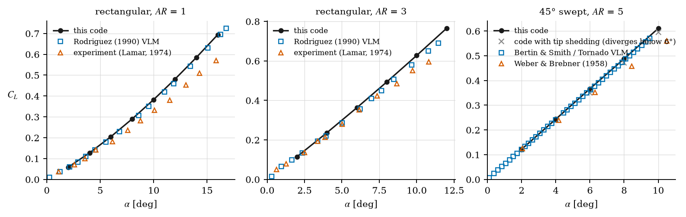
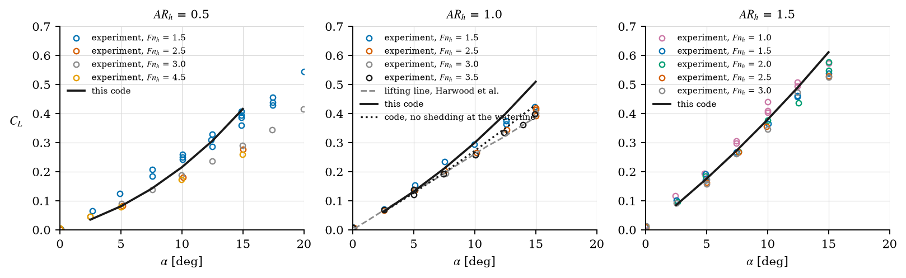
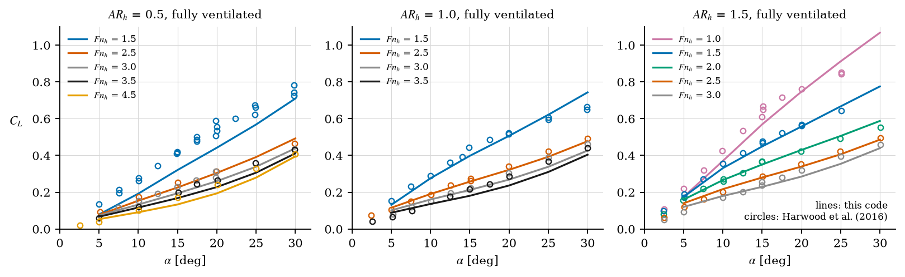
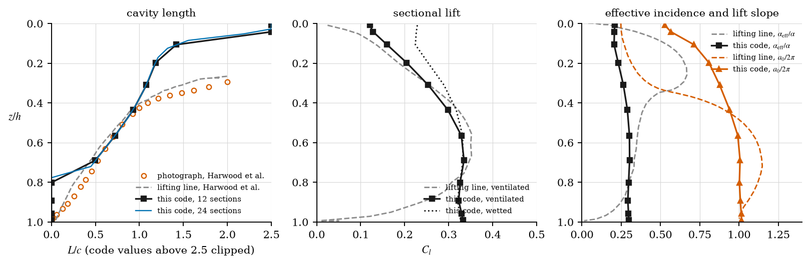

# Validation against digitised curves

This folder holds the digitised measurements and reference computations, the script that
compares the code with them, and the results. The data were digitised by L. Orain (repository
`vortex_lattice_method-cavity_flow`, branch `wake_rel`, September 2026) from the figures of
Harwood, Young and Ceccio (2016), Rodriguez (1990), Lamar (1974), Bertin and Smith (1998) and
Weber and Brebner (1958). The raw curves are in `data/raw/` with their provenance
(`data/raw/README.md`); `import_digitised.py` converts them into the template format of
`data/TEMPLATE.csv`, one CSV per source and quantity; `validate.py` runs the code at the
conditions of every curve and writes `validate.json` and Figures 1 to 4. The report
`docs/report/methods_and_validation.md`, Sect. 10, places these results in the context of the
validation plan. All runs use the numerical settings of the report: 12 sections and eight
chordwise panels on the strut, cosine spacing, a time step of 0.05 chords and three chords of
travel, unless stated otherwise.

```
python docs/validation/import_digitised.py      # raw curves -> data/*.csv           (1 s)
python docs/validation/validate.py              # all cases, JSON and figures        (25 min)
python docs/validation/validate.py --only=C     # rerun one case, keep the others
python docs/validation/validate.py --plot       # figures from validate.json only
```

## Case A: wetted solver without free surface

Rectangular wings of aspect ratio ($AR$) 1 and 3 and a rectangular wing of $AR$ = 5 swept by
45° are run at incidences from 2° to 16° with 15 spanwise panels per half-span, five chordwise
panels, and a travel of at least three chords and two spans. Doubling the travel changes the lift
coefficient at 8° by 0.5 % or less (Table A.1). The rectangular wings shed vorticity from both
tips, as in the report; the swept wing does not, for the reason given below.

*Table A.1. Lift slope per radian from a fit through the origin over incidences up to 10°, and
mean relative difference of the code from the reference over the incidences of the reference.*

| Wing | Code | Vortex lattice reference | Experiment | Code minus VLM | Code minus experiment |
|---|---|---|---|---|---|
| rectangular, $AR$ = 1 | 2.08 | 1.97, Rodriguez (1990), free wake | 1.77, Lamar (1974) | +3 % | +14 % |
| rectangular, $AR$ = 3 | 3.54 | 3.37, Rodriguez (1990), free wake | 3.24, Lamar (1974) | +4 % | +7 % |
| 45° swept, $AR$ = 5, no tip shedding | 3.50 | 3.45, Bertin and Smith (1998), Tornado, straight wake | 3.17, Weber and Brebner (1958) | +1 % | +10 % |


*Figure 1. Lift coefficient versus incidence of the code, the reference vortex lattice methods
and the experiments: (a) rectangular wing, $AR$ = 1; (b) rectangular wing, $AR$ = 3; (c) 45°
swept wing, $AR$ = 5. In (c) the crosses are the code with tip shedding, which diverges below 6°.*

The code lies 3 to 4 % above the free-wake vortex lattice of Rodriguez on both rectangular
wings, and reproduces the convex lift curve of the $AR$ = 1 wing that the side-edge vortices
produce, with a slope that rises from 1.7 per radian at 2° to 2.5 per radian at 16° (Figure 1a).
The excess over the experiments, 14 % at $AR$ = 1 and 7 % at $AR$ = 3, is the difference
between a potential-flow lattice and a real wing with a boundary layer, and is the same order
as the 17 % quoted in the report for Bartlett and Vidal (1955).

**Tip shedding on a swept wing diverges.** With tip shedding and cosine spacing, the solution
for the swept wing diverges at 2° and 4° within ten time steps (lift coefficients of −879 and
−498 after ten chords of travel) and converges at 6° and above, where it is within 3 % of the
straight-wake vortex lattice. After the first step the tip panel of the swept wing carries
2.7 times the circulation of its neighbour, against 0.65 times on the unswept wing of the same
aspect ratio, and the roll-up moves the first shed corners of the tip column by 0.0013 spans,
which is of the order of the cutoff distance (0.4 of the tip panel width, 0.0015 spans). The
cancellation between the wing's tip-edge segment, in the influence matrix, and the coincident
shed edge, in the right-hand side, on which the tip shedding rests (report, Sect. 4.6), is then
lost at the tip control point and the tip circulation grows without bound. The instability does
not occur with uniform spacing, without sweep, or without tip shedding. For a swept wing of
moderate aspect ratio, where the flow does not separate at the side edge, tip shedding should
be off (`shedding="none"`); the comparison in Table A.1 is made in this setting.

## Case B: wetted strut with the antisymmetric image

The strut of Harwood et al. (2016), chord 0.2794 m, is run at $AR_h$ = 0.5, 1 and 1.5 and at
incidences from 2.5° to 15°. The lift coefficient is on the immersed area $h c$. The
antisymmetric image does not depend on the Froude number, so one computed curve per aspect
ratio is compared with the measurements at every Froude number (Figure 2, Table B.1).

*Table B.1. Lift slope per radian over incidences up to 10° and mean relative difference of the
code from the measurements of Harwood et al. (2016), fully wetted.*

| $AR_h$ | Code | $Fn_h$ = 1.0 | 1.5 | 2.0 | 2.5 | 3.0 | 3.5 | 4.5 |
|---|---|---|---|---|---|---|---|---|
| 0.5 | 1.13 | – | 1.48 (−21 %) | – | 0.93 (+16 %) | 1.06 (+9 %) | – | 0.98 (+11 %) |
| 1.0 | 1.65 | – | 1.69 (−2 %) | – | 1.53 (+9 %) | 1.48 (+10 %) | 1.48 (+9 %) | – |
| 1.5 | 2.12 | 2.37 (−10 %) | 2.09 (0 %) | 2.11 (+1 %) | 2.01 (+7 %) | 1.97 (+5 %) | – | – |


*Figure 2. Lift coefficient versus incidence of the fully wetted strut, code against the
measurements of Harwood et al. (2016) at every Froude number and their lifting-line model: (a)
$AR_h$ = 0.5; (b) $AR_h$ = 1; (c) $AR_h$ = 1.5. The dotted line in (b) is the code without
vortex shedding from the waterline edge.*

The measured lift slope falls with the Froude number, by 13 % between $Fn_h$ = 1.5 and 3.5 at
$AR_h$ = 1, and settles above $Fn_h$ = 2.5. The code, whose image is the high-Froude limit,
matches the measurements at $Fn_h$ = 1.5 within 2 % at $AR_h$ = 1 and 1.5, and is 5 to 10 %
above them at $Fn_h \ge 2.5$, where the image should apply best. The lifting-line model of
Harwood et al., with the same image, has a slope of 1.49 per radian at $AR_h$ = 1, which is
the high-Froude measured value; the code is 12 % above it. At $AR_h$ = 0.5 the measurements
scatter by 50 % between Froude numbers and the code lies within that scatter, 21 % below the
$Fn_h$ = 1.5 curve and 9 to 16 % above the others. The computed lift curves are convex: at
$AR_h$ = 1 the slope rises from 1.40 per radian at 2.5° to 1.94 per radian at 15°, whereas the
measured curves at $Fn_h \ge 2.5$ are linear to within 3 %.

**The excess comes from the waterline edge.** Four variants at $AR_h$ = 1 locate the
difference (Table B.2). Doubling the sections leaves the slope unchanged, so it is not a
resolution effect. The symmetric (rigid-wall) image nearly doubles the lift and is excluded, as
in the report. Without any tip shedding the slope falls to 1.31 per radian, 12 % below the
measurements. Shedding from the tip only, and not from the waterline edge, gives 1.52 per
radian, within 3 % of the measurements at $Fn_h \ge 2.5$ and of the lifting-line model, and
the sectional lift then vanishes at the waterline (0.03 at $z/h$ = 0.01 against 0.23 with
waterline shedding, Figure 4b), as the atmospheric-pressure condition requires: with equal
pressure on both sides of the strut at the free surface, the loading must go to zero there.
Shedding a vortex column from the waterline edge treats that edge as a separated side edge and
keeps a finite loading on it, which accounts for the 8 % excess and for part of the convexity.
The report's results (Sects. 6 to 9) were all obtained with waterline shedding; rerunning them
with `shedding="right"` for a strut is recommended, with the caveat that the lower wetted lift
also lowers the effective incidence that drives inception and the cavity length.

*Table B.2. Numerical variants at $AR_h$ = 1: lift slope per radian and lift coefficient at 10°.*

| Variant | Slope | $C_L$ at 10° |
|---|---|---|
| report settings (shedding from both edges, antisymmetric image, 12 sections) | 1.65 | 0.299 |
| 24 sections | 1.65 | 0.302 |
| shedding from the tip only, not from the waterline | 1.52 | 0.272 |
| no tip shedding | 1.31 | 0.229 |
| symmetric image | 2.92 | 0.522 |
| measurements, $Fn_h$ = 2.5 to 3.5 | 1.48 to 1.53 | 0.256 to 0.262 |

## Case C: fully ventilated strut

The cavity is imposed on every section (`vent.force`) at incidences from 5° to 30° at each of
the 14 combinations of $AR_h$ and $Fn_h$ measured (Figure 3, Table C.1). The regime the code
reports is fully ventilated (FV) at all points except at 5°, and at 10° for $Fn_h \le 1.5$,
where the cavity does not reach the tip and the regime is partially ventilated (PV); Harwood
et al. classified those points as fully ventilated.

*Table C.1. Fully ventilated strut: mean relative difference and largest absolute difference of
the computed lift coefficient from the measurements of Harwood et al. (2016) over the measured
range of incidence, and regime reported by the code at 5°, 10°, ..., 30° (P partially, V
fully ventilated).*

| $AR_h$ | $Fn_h$ | Mean difference | Largest difference | Regimes |
|---|---|---|---|---|
| 0.5 | 1.5 | −25 % | 0.106 | PPPPVV |
| 0.5 | 2.5 | −6 % | 0.027 | PPVVVV |
| 0.5 | 3.0 | −14 % | 0.054 | PVVVVV |
| 0.5 | 3.5 | −7 % | 0.053 | PVVVVV |
| 0.5 | 4.5 | −5 % | 0.049 | VVVVVV |
| 1.0 | 1.5 | −4 % | 0.047 | PPPPVV |
| 1.0 | 2.5 | −1 % | 0.029 | PVVVVV |
| 1.0 | 3.0 | −6 % | 0.050 | PVVVVV |
| 1.0 | 3.5 | −3 % | 0.059 | PVVVVV |
| 1.5 | 1.0 | −7 % | 0.069 | PPPPPP |
| 1.5 | 1.5 | −1 % | 0.026 | PPPVVV |
| 1.5 | 2.0 | +2 % | 0.037 | PPVVVV |
| 1.5 | 2.5 | +2 % | 0.022 | PVVVVV |
| 1.5 | 3.0 | −1 % | 0.041 | PVVVVV |


*Figure 3. Lift coefficient versus incidence of the fully ventilated strut for Froude numbers
from 1.0 to 4.5, code (lines) against the measurements of Harwood et al. (2016) (circles): (a)
$AR_h$ = 0.5; (b) $AR_h$ = 1; (c) $AR_h$ = 1.5.*

The ventilated lift is within 7 % of the measurements, on average over each curve, at $AR_h$ = 1
and 1.5 for every Froude number, with the largest single difference 0.07 at $AR_h$ = 1.5 and
$Fn_h$ = 1.0, below the Froude number at which the image is valid. The trends with incidence
and with Froude number are reproduced: between $Fn_h$ = 1.5 and 3.5 at 20° and $AR_h$ = 1 the
lift falls by a factor 1.8 in the measurements and 2.1 in the code. The report found the code 5
to 15 % below the semi-empirical ratio of Damley-Strnad et al. (2019) at $Fn_h$ = 2.5 (its
Table 8.1); against the measurements at the same condition it is within 1 % on average. At
$AR_h$ = 0.5 the code is 5 to 14 % low for $Fn_h \ge 2.5$ and 25 % low at $Fn_h$ = 1.5, where
the measured curve is also steeper than at the other Froude numbers. The wetted lift of the same
strut is 9 to 16 % high at $Fn_h \ge 2.5$ (Table B.1); with waterline shedding off, the
ventilated lift would fall as well, by an amount not computed here.

## Case D: cavity profile

At $\alpha$ = 10°, $Fn_h$ = 1.5 and $AR_h$ = 1, the sectional cavity length of the code is
compared with the length measured on the photograph of Harwood et al. and with their
lifting-line model, together with the sectional lift, effective incidence and lift slope of the
same model (Figure 4). The code is run with 12 and 24 sections and four chords of travel; the
two meshes agree within 0.05 chords at every depth.


*Figure 4. Sectional quantities versus depth at $\alpha$ = 10°, $Fn_h$ = 1.5, $AR_h$ = 1: (a)
cavity length, code against the photograph and the lifting-line model of Harwood et al.
(2016); (b) sectional lift, ventilated and wetted; (c) effective incidence and lift slope, code
against the lifting-line model. In the code $\alpha_\text{eff}$ is $C_l/2\pi$ of the wetted
solution and $a_0$ is the ventilated $C_l$ divided by that $\alpha_\text{eff}$.*

Between 0.43 and 0.72 of the immersion the computed length is within 10 % of the photograph
(0.93 against 0.98 chords at $z/h$ = 0.43, 0.50 against 0.53 at 0.69) and closer to it than the
lifting-line model, which is 10 to 20 % short over the same range. Two disagreements bound this
range. Above $z/h$ = 0.35 the measured cavity lengthens to two chords, the edge of the
photograph, while the computed one grows to 1.1 chords at $z/h$ = 0.31 and only exceeds two
chords within 0.05 of the surface; the lifting-line model has the same defect to a lesser
degree (1.5 chords at $z/h$ = 0.31). Below $z/h$ = 0.75 the code has no cavity, because the
sectional length there is shorter than one chordwise panel (0.125 chords) and the section is
declared unable to hold one, whereas the photograph shows a cavity that shortens smoothly to
zero at the tip (0.37 chords at $z/h$ = 0.80, 0.07 at 0.96). The code therefore reports the
case as partially ventilated with two thirds of the span covered, where the experiment is fully
ventilated. A finer chordwise mesh, or a hold criterion on the sectional length rather than on
the panel count, would extend the cavity towards the tip. Along the whole profile the
cavitation number of the code matches the lifting-line model, as it must, since both are
$2 g z / u_\infty^2$.

The sectional lift of the lifting-line model goes to zero at the surface and at the tip; the
code keeps 0.12 at the surface, because of the waterline shedding discussed in Case B, and 0.33
at the tip, because of the tip shedding, which the report adopts as the model of side-edge
separation. The ventilated lift slope of the code falls to 0.5 of $2\pi$ at the surface, not to
the supercavitating limit of 0.25 that the lifting-line model reaches, because on the lattice
the circulation of a section is redistributed to its neighbours rather than lost.

## Summary of findings

1. The wetted lattice reproduces the free-wake vortex lattice of Rodriguez within 4 % on
   rectangular wings of $AR$ = 1 and 3, and the straight-wake vortex lattice within 1 %
   on a 45° swept wing of $AR$ = 5 without tip shedding. With tip shedding the swept wing
   diverges below 6°: tip shedding is for low-aspect-ratio unswept wings and struts only.
2. The wetted strut is within 2 % of the measurements at $Fn_h$ = 1.5 and 5 to 10 % above them
   at $Fn_h \ge 2.5$ for $AR_h$ = 1 and 1.5. The excess is the vortex column shed from the
   waterline edge; without it the code is within 3 % of the high-Froude measurements and of
   Harwood's lifting line, and the loading vanishes at the surface as it should.
3. The fully ventilated lift is within 7 % of the measurements at $AR_h$ = 1 and 1.5 over
   $Fn_h$ = 1 to 3.5 and $\alpha$ = 5° to 30°, and 5 to 25 % low at $AR_h$ = 0.5.
4. The cavity length is within 10 % of the photograph over the middle third of the immersion.
   The code's cavity is too short within a third of a chord of the surface and absent over the
   lower quarter of the immersion, where the measured cavity shortens smoothly to the tip; the
   one-panel hold criterion is the cause of the latter.
